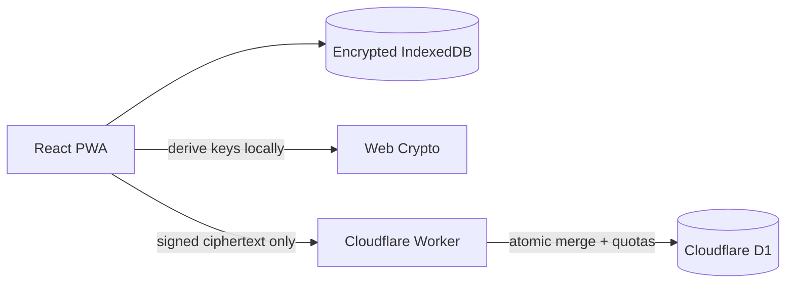

# Finance Vault

An open-source, offline-first personal finance tracker with zero-knowledge cloud sync.

Finance Vault encrypts transactions in the browser before they leave the device. The hosted backend stores ciphertext, coordinates multi-device merges, and never receives transaction details or the recovery phrase.

> **Status:** active prototype. The encrypted sync API is live in preview; the product UI and security hardening are still in progress. Do not use it as your only financial backup yet.

## Why it is different

- **Local-first:** reads and writes work from IndexedDB without a network connection.
- **Zero-knowledge sync:** AES-GCM encryption happens in the browser.
- **Passwordless recovery:** one recovery phrase derives separate encryption, identity, and request-authentication material.
- **Conflict-safe:** atomic D1 batches merge records deterministically across devices.
- **Resource-aware hosting:** per-vault storage, global signup capacity, payload, and request-rate limits protect the free service.

## Architecture



The backend uses a **local-first, zero-knowledge, last-write-wins record architecture**. Every record carries an update timestamp and device ID; the server uses both for deterministic conflict resolution. Signed requests include a timestamp and unique request ID for replay protection.

See [the architecture document](docs/architecture.md) for the trust model, data flow, trade-offs, and quota design.

## Hosted free tier

- 1 MiB encrypted storage per free vault
- 200 vaults per deployment
- 1 MiB maximum sync request
- IP and per-vault request-rate limits
- production vault creation disabled until bot protection is connected

An owner vault can be elevated separately before public registration opens, keeping personal capacity reserved.

## Run locally

```bash
cd next-app
npm install
npx wrangler d1 migrations apply finance-vault-preview --local
npm run worker:dev
```

In another terminal:

```bash
cd next-app
npm run dev
```

The original Node/SQLite prototype remains at the repository root while the new application is developed in `next-app/`.

## Project layout

```text
next-app/
├── src/                 React PWA and browser cryptography
├── worker/              Cloudflare sync API
├── migrations/          Versioned D1 schema
└── wrangler.jsonc       Local, preview, and production bindings
```

## Security

This project handles sensitive data and has not yet received an independent security audit. Please read [SECURITY.md](SECURITY.md) before testing with real data. Report vulnerabilities privately through GitHub Security Advisories.

## Contributing

Issues and pull requests are welcome. Start with [CONTRIBUTING.md](CONTRIBUTING.md).

## License

[MIT](LICENSE) © Om Surushe

## Legacy app

The repository root contains the original Node 22 and SQLite application. It supports authenticated server use, automatic backups, JSON import, and direct browser-local mode. Production requires `AUTH_USERNAME`, `AUTH_PASSWORD`, and `SESSION_SECRET`; it fails closed if they are missing. Real exports, database files, financial profiles, and credentials must remain outside Git.

Keep this existing repository private because older Git history contains personal finance data. A history-clean repository is required before publishing the project as open source.
