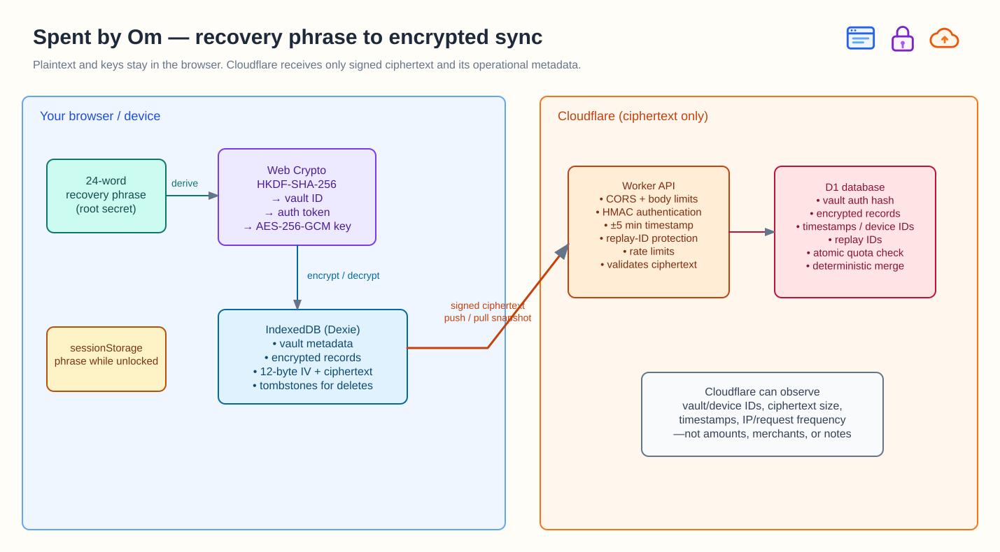
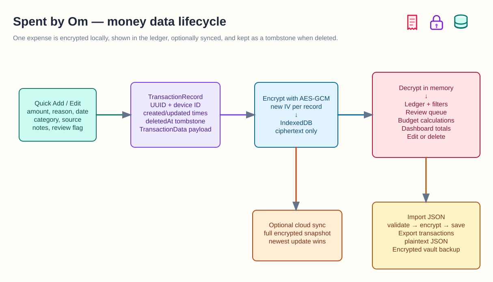
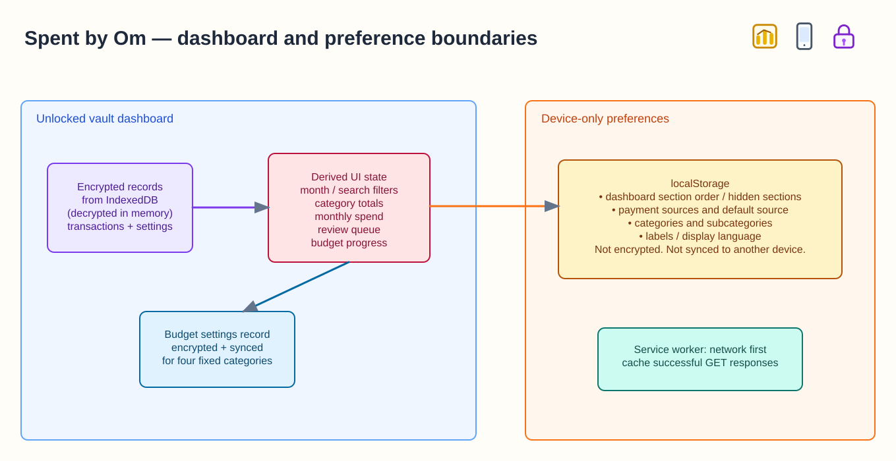
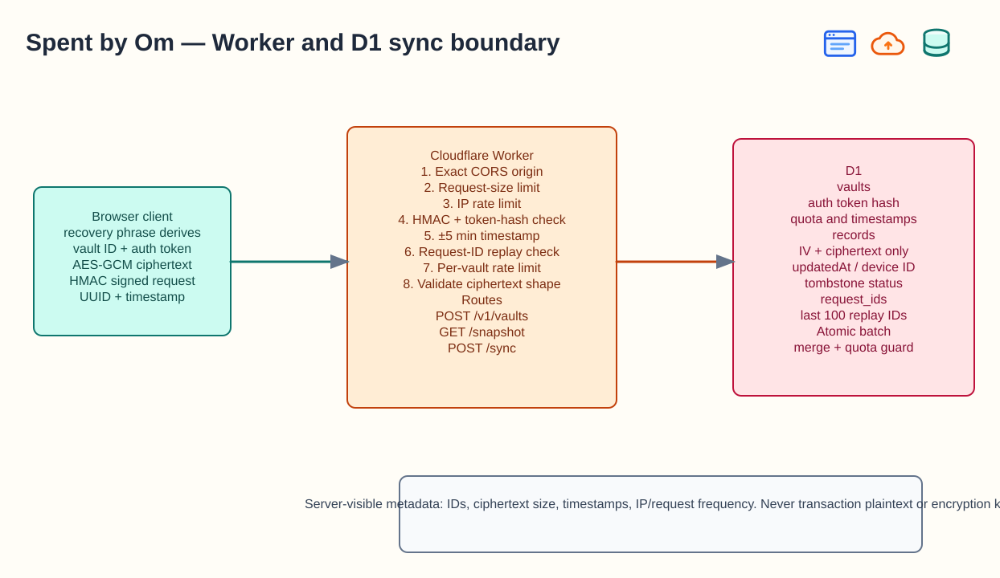
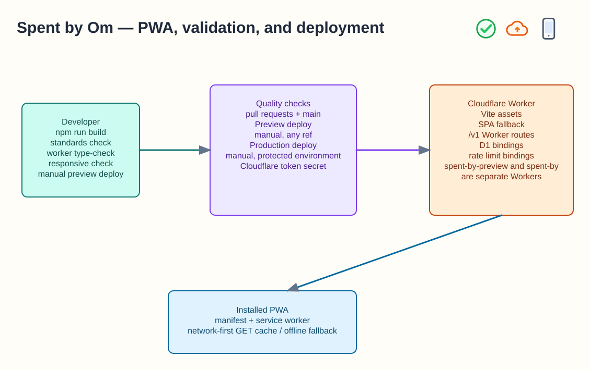

# Architecture diagrams

These maps explain the app without requiring readers to inspect the code. The previews render directly on GitHub; click any preview to open its editable [Excalidraw](https://excalidraw.com) source.

## Vault lifecycle

How a recovery phrase becomes browser-only encryption and optional encrypted sync.

## Expense lifecycle

What happens from manually adding an expense through local storage, review, export, and optional sync.

## Dashboard boundaries

Which dashboard data syncs and which preferences remain on one device.

## Worker sync boundary

What the Cloudflare Worker verifies and the limited metadata it can see.

## PWA and deployment

How validation, manual deployments, the Worker, and the installable app fit together.

The visual cues show browser/device, local encryption, Cloudflare, database, receipt, chart, and deployment stages. The text in each map remains the source of truth.
